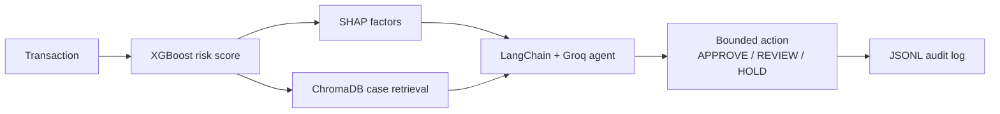

# RiskShield — AI Risk Manager

Explainable fraud assessment for payment transactions. Built for the Razorpay AI Buildathon, Track 02 (AI Risk Manager), on the [ULB Credit Card Fraud](https://www.kaggle.com/datasets/mlg-ulb/creditcardfraud) dataset.

**Defense-only.** The agent may choose exactly one of `APPROVE`, `REVIEW`, or `HOLD`. It is instructed not to suggest bypassing security controls or fabricating evidence. Parse failures and LLM outages fall back to the same bounded set.

## 1. Problem statement

Merchants lose money when fraudulent payments clear, when goods are returned after a stolen-card purchase, and when issuers reverse settled amounts as chargebacks. The operational problem is not only catching fraud — it is catching it without flooding analysts with false alarms.

The ULB Credit Card Fraud dataset makes that trade-off concrete: **492 fraud cases out of 284,807 transactions (0.173% fraud rate)**. A model that always predicts “legitimate” is ~99.83% accurate and useless. Features `V1`–`V28` are PCA-transformed; `Time` is seconds since the first transaction; `Amount` is the transaction value; `Class` is 0 (legitimate) or 1 (fraud).

## 2. Architecture overview



A transaction is scored by a temporally trained XGBoost classifier. SHAP attributes that score to individual PCA components (plus `Time` and `Amount`). Independently, a StandardScaler + ChromaDB index retrieves the three nearest historical cases from the training split. LangChain + Groq synthesizes the score, SHAP factors, and neighbor classes into a short analyst justification and one bounded action. Every decision is appended to `logs/decisions.jsonl`.

## 3. Results

Baselines use a **temporal 70/30 split** (sort by `Time`; no shuffle). Metrics below are **fraud-class** precision / recall / F1 and PR-AUC on the held-out 30% test set, at the default 0.50 threshold (`notebooks/02_baseline_model.ipynb`):

| Model | Precision | Recall | F1 | PR-AUC |
|---|---|---|---|---|
| Logistic Regression (naive) | 0.7681 | 0.4907 | 0.5989 | 0.7054 |
| Logistic Regression (`class_weight='balanced'`) | 0.0548 | 0.8796 | 0.1031 | 0.7677 |
| XGBoost (`scale_pos_weight`) | 0.8989 | 0.7407 | 0.8122 | 0.7988 |

XGBoost is the candidate taken into threshold optimization. Training is then restricted to the first **55%** of the timeline; the next **15%** is validation; the last **30%** remains held-out test (`notebooks/03_threshold_optimization.ipynb`).

**Cost model (validation, then applied once to test):** a false negative costs the transaction’s `Amount`; a false positive costs a fixed **₹500** (placeholder for manual review / customer friction — the dataset has no real ops-cost field). Cost-minimizing threshold on validation is **0.95**.

Held-out test at 0.95 vs default 0.50:

| Threshold | Precision | Recall | F1 | Expected cost (₹) |
|---|---|---|---|---|
| 0.95 (optimized) | 0.9294 | 0.7315 | 0.8187 | 7,106.87 |
| 0.50 (default) | 0.8100 | 0.7500 | 0.7788 | 13,272.99 |

That is a **46%** reduction in expected cost on the test set (₹13,273 → ₹7,107 when rounded to the nearest rupee as in the notebook’s narrative). Precision rises (0.929 vs 0.810) while recall drops slightly (0.732 vs 0.750). The ₹500 false-positive cost is an assumption, not measured operations data.

## 4. The case-grounded decision layer

The classifier score is not enough for an analyst. On the same held-out examples used in `explain.py` / `case_store.py`:

| Example | Actual class | Risk score | Top SHAP factors | Neighbor fraud rate (k=3) |
|---|---|---|---|---|
| True positive | 1 | 0.992795 | V14 (+7.12), V26 (−1.80), V4 (+1.72) | 1/3 |
| False positive | 0 | 0.994167 | V14 (+6.346180), V4 (+2.144749), V1 (−1.317468) | **3/3 (1.0)** |
| False negative | 1 | 0.000052 | V12 (−2.63), V4 (−1.41), V14 (+1.34) | 0/3 |

The false-positive risk score (**0.9942**) is nearly identical to the true-positive score (**0.9928**). From the probability alone they are statistically indistinguishable. What differs is precedent: all three retrieved neighbors of the false positive were confirmed fraud in the training index (amounts 1.00, 1.00, 1.00; distances 31.35, 33.03, 33.19). The true positive’s nearest neighbor was fraud, but the next two were legitimate high-amount cases. The false negative sat next to three legitimate transactions.

That is the reviewer’s handle: not “the model said 0.99,” but “this looks like prior fraud cases in feature space, driven by V14 and V4.”

Live agent output on this false positive (`action`: **HOLD**):

> The transaction has a risk score of 0.9942, exceeding the 0.95 threshold, and the model flagged it as high risk. SHAP analysis shows strong positive contributions from V14 (+6.35) and V4 (+2.14), outweighing the negative influence of V1, indicating a pattern consistent with fraud. Additionally, the neighbor fraud rate is 1.00, with all three nearest neighbors classified as fraud, reinforcing the high likelihood of malicious activity. Given these indicators, the transaction should be blocked pending further review.

The case store is structured k-NN over scaled `Time` / `V1`–`V28` / `Amount`, not semantic RAG. Its job is to make a high score inspectable.

## 5. Limitations

- **₹500 false-positive cost is a placeholder.** The ULB dataset has no analyst minutes, customer-friction, or chargeback-ops costs.
- **False-negative cost is only `Amount`.** Chargeback fees, interest, regulatory penalties, and downstream identity theft are not in the data.
- **Fraud rate drifts across the temporal splits:** train 0.2234%, validation 0.0796%, test 0.1264%. A threshold tuned on validation can shift as the mix changes.
- **Single global threshold**, not a tiered response (auto-block vs step-up auth vs queue).
- **Case store is k-NN over engineered features**, not text-based RAG. Usefulness is bounded by how representative the stratified training sample is (all 350 train fraud rows plus legitimate fill to 5,000).
- **`V1`–`V28` are anonymized PCA components.** SHAP is reported at the component level with no real-world merchant/device interpretation.

## 6. What broke, and how it was fixed

**(a) Groq model deprecation.** `llama-3.1-8b-instant` was hardcoded and then removed from Groq mid-build. The model is now `GROQ_MODEL` (default `openai/gpt-oss-20b`). If the Groq call fails (rate limit, network, deprecation, missing key), `POST /assess-transaction` still returns **200**: `action` is `HOLD` if `risk_score >= threshold` else `APPROVE`, `justification` states that the LLM was unavailable, `llm_fallback_used` is `true`, and the audit log records the fallback (including `llm_error` when present).

**(b) Stale environment variable.** During a deliberate failure test, an emptied `.env` key was still overridden by a `GROQ_API_KEY` left in an earlier terminal session, so the LLM path kept working and the resilience test looked like a false negative. Re-running in a fresh terminal showed the leak. Fix: `load_dotenv(..., override=True)` in `src/api.py` and `src/agent.py` so `.env` is the single source of truth regardless of shell session state. `create_llm_client()` reads `GROQ_MODEL` at call time, after dotenv has loaded.

## 7. Setup

```bash
python -m venv .venv
# Windows: .venv\Scripts\activate
# macOS/Linux: source .venv/bin/activate
pip install -r requirements.txt
```

Dataset (place at `data/creditcard.csv`):

```bash
kaggle datasets download -d mlg-ulb/creditcardfraud
# unzip and copy creditcard.csv to data/creditcard.csv
```

Copy `.env.example` to `.env` and set:

- `GROQ_API_KEY` — [Groq console](https://console.groq.com/)
- `GROQ_MODEL` — default `openai/gpt-oss-20b`

Then, in order:

```bash
python src/explain.py       # trains XGBoost, writes models/fraud_xgb.joblib + config
python src/case_store.py    # builds ChromaDB index under data/case_store/
python src/api.py           # FastAPI on http://0.0.0.0:8000
python scripts/test_api.py  # fetches /example-transactions and POSTs the false-positive payload
```

Useful endpoints: `GET /health`, `GET /example-transactions`, `POST /assess-transaction`.
